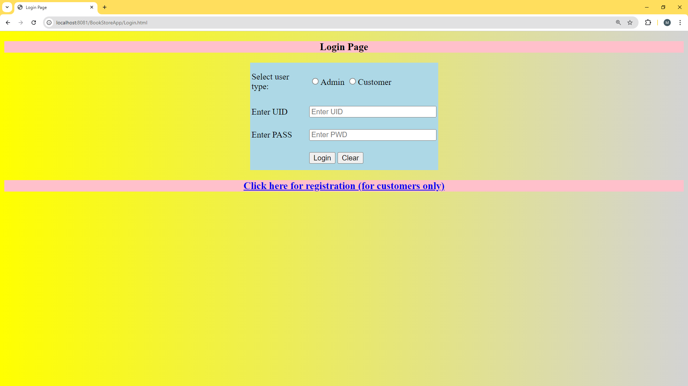
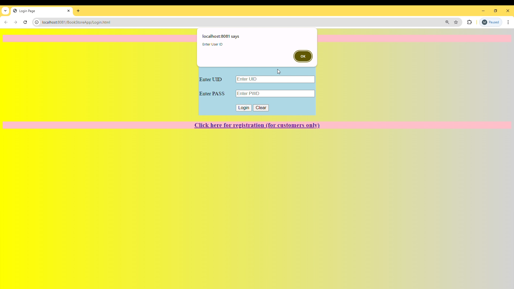
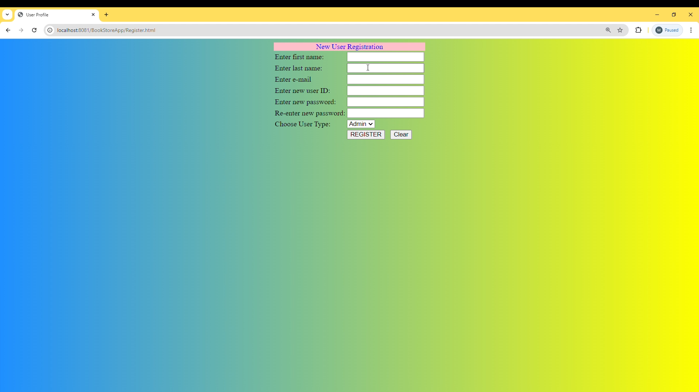
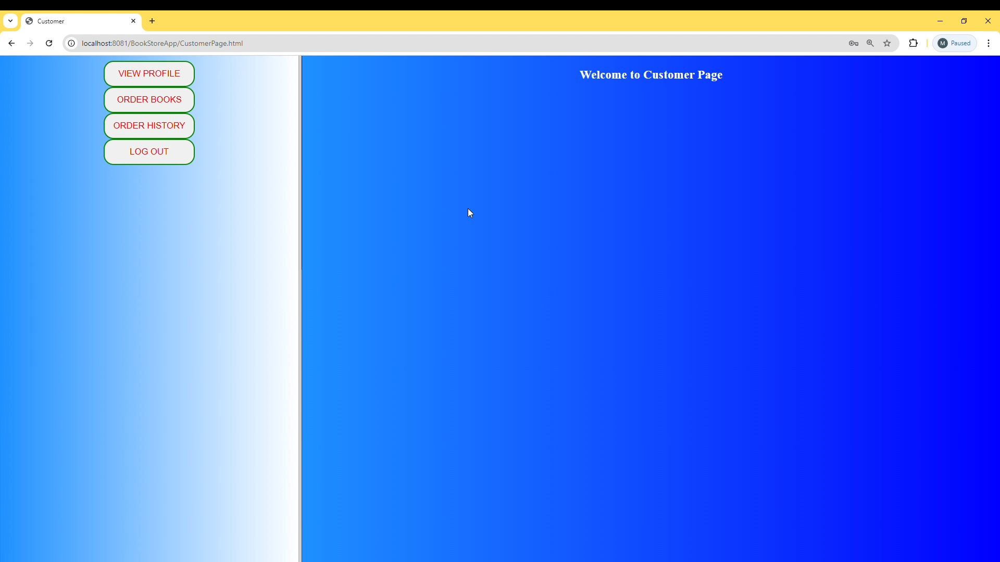
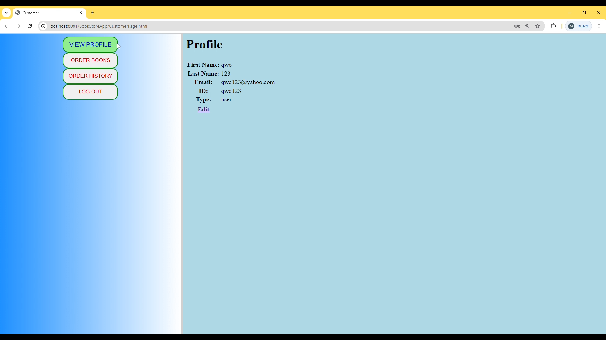
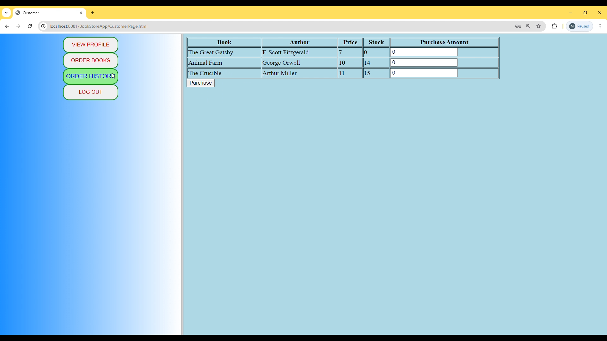
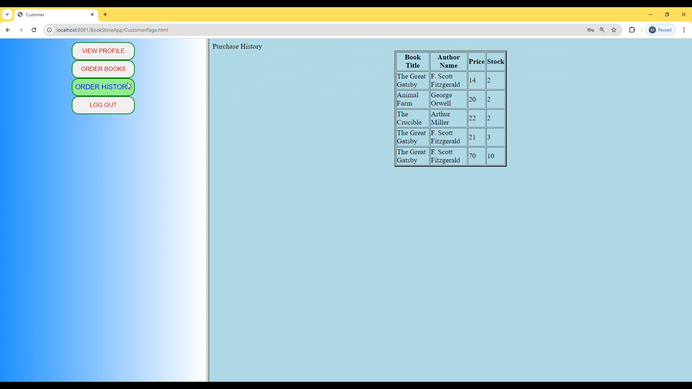

# JavaBookStoreApp

**JavaBookStoreApp** is a full-stack Java-based web application for managing a bookstore. It showcases essential full-stack development skills, including user authentication, profile management, book ordering, and data handling. The backend is implemented in Java, while the frontend is built with HTML. SQL is used for storing user and book data.

## Features

### 1. User Registration & Login System
- Users can register with:
  - First Name
  - Last Name
  - Email
  - User ID
  - Password
  - User Type (Admin or Customer)
- The login system validates User ID and Password through the SQL database.

### 2. Profile Management
- Users can view and modify their personal account details after logging in.

### 3. Book Ordering System
- Users can browse and order books, with the orders stored and tracked in the SQL database.

### 4. Order History
- Users can review their previous book orders in their account.

### 5. Admin & Customer Roles
- Admins manage books and view all orders.
- Customers focus on ordering books and managing their own profiles.

## Technologies Used
- **Backend**: Java
- **Frontend**: HTML
- **Database**: SQL (storing user and book data)

## Example Screenshots

Click the images for a better view.

### Login Page

### Login Failed

### New User Registration

### Customer Page

### View Profile

### Order Books

### Purchase History

## Purpose
This project is intended for display as part of my portfolio to showcase my abilities in full-stack development, specifically in Java for backend logic, HTML for frontend presentation, and SQL for database management.
